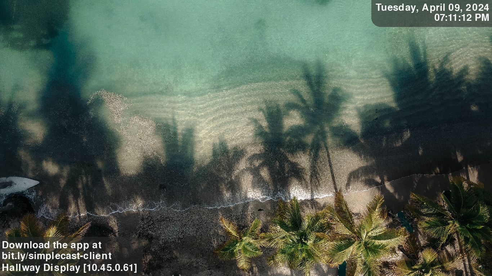
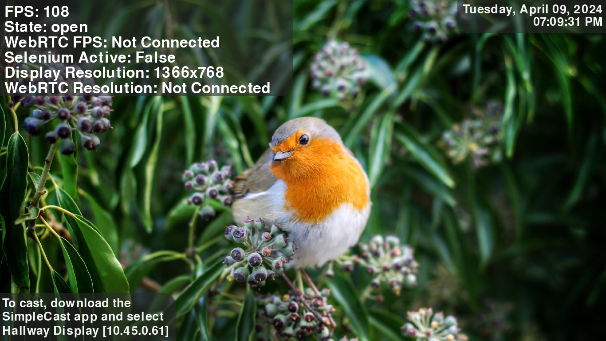
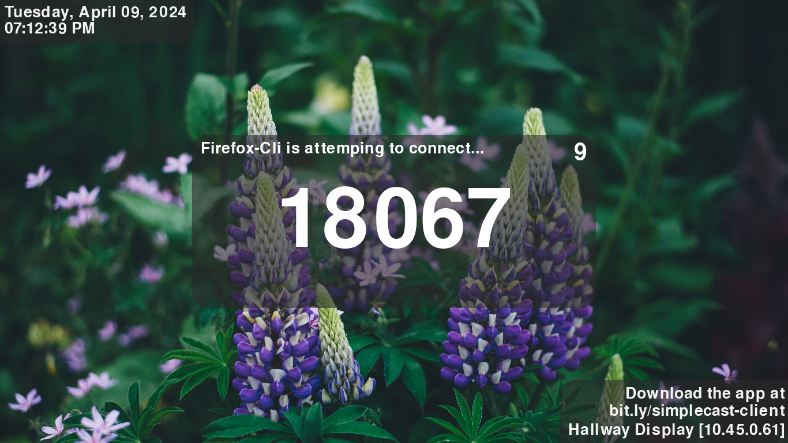
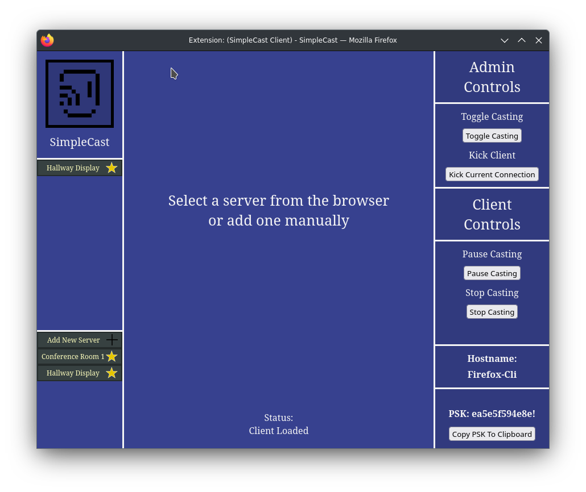
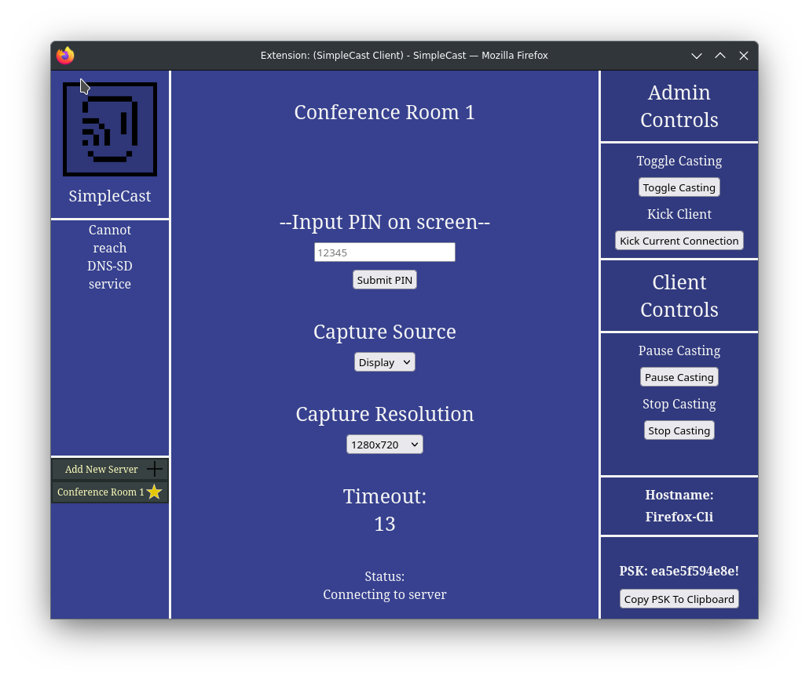
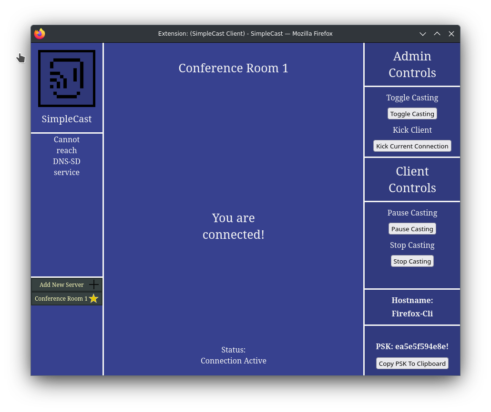
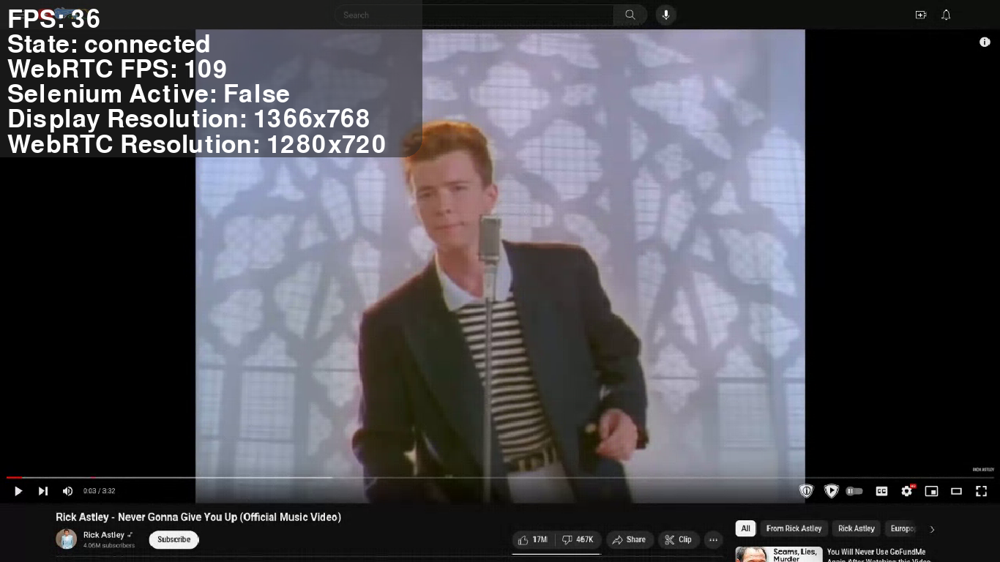

  

Client Downloads:
https://r0nam1.github.io/SimpleCast/

SimpleCast is an AioRTC based software that takes any video and audio frames and sends them over the network via the WebRTC standard to 'cast' to another display. Completely complient with WebRTC and HTTP standards and easy to manage, so implementing a custom client is easy, along with automation. 
It runs on any Debian flavored distro.

For use anywhere that wireless casting akin to a ChromeCast is wanted, but with more management and the ability to do pin authentication and other like-features.
Not a replacement for an HDMI cable if one can be ran or is wanted. Depending on hardware ran on it might be able to display 4K, it probably cannot STREAM 4k, defaults to streaming 720p for balance between framerate and resolution. 

Try different display resolutions between 720p, 1080p and 4K and see what the debug FPS is to see what your hardware can handle.

Features include:
- Showing a slideshow by default, with the option of a screenshot of a webpage
- Pin Authentication, with a PSK bypass for certain clients
    ( For instance, Students have to type in a PIN, while Teachers can auto connect)
- PSK clients can kick other clients and toggle castability to the server
- PSK Whitelist
- Debug option to show resolution and FPS
- Audio Redirection
- Ability to pause casting
- Browser based clients (Maybe OS based in the future)
- Logging to local file, simplecast.log
- Broadcast traffic for passive discovery and mDNS for active discovery (May make broadcast obselete)

Imagined for use on a Le Potato board, along with case and fan for cooling and lifetime. You can find them on Amazon for around $50 with case and power supply.

## Config Keys & Possible Values
| Config Key | Meaning | Value Type | Value Example |
| ---------- | ------- | ---------- | ------------- |
| `serverName` | The name that the server displays and broadcasts | String | "Conference Room 1" |
| `usePINAuthentication` | Force PIN authentication or allow anybody to connect at anytime from anywhere | Boolean | true or false |
| `allowAudioRedirection` | Allow clients to cast audio to the server | Boolean | true or false |
| `allowedPskList` | List of client PSK's that have authority over the server, usually assigned Teachers or equivilent | String array | ["psk1", "psk2"] |
| `slideshowPictures` | List of pictures in backgrounds folder to display, can also be a URL with http locator (Eventually) | String array | ["0.jpg", "1.jpg"] |
| `serverIP` | The IP Address of the primary interface the server uses, forces you to make it static or static lease | String | "10.42.255.249" |
| `shuffleSlideshow` | Either show background slides in sequencial order, or randomly shuffle | Boolean | true or false |
| `connectionScreenScale` | The size of information drawn on the 'open' screen | Float | "low: 0.5", "meduim: 1" or "high: 1.5" or anything else |
| `countDownTime` | How long to wait until a connecting client becomes invalid | Integer | 20 |
| `slideshowAlphaStepdown` | Amount to step down fading slideshow transitions | Integer | 1 - 255, Do 255 for no fading |
| `doBroadcastDiscovery` | Enable or disable subnet broadcast traffic to advertise server | Boolean | true or false |
| `infoScreenConnectionText` | What connect text should the 'open' screen show | String | "link" to show bit.ly link, "name" for just the server name, "default" for default text |
| `infoTextAlignment` | Should the info text on open flip every 120 seconds, or be statically left or right | String | "flip", "left", "right" |
| `whitelistArray` | PSK's to whitelist | String array | "psk1", "psk2" |
| `enableWhitelist` | Should the PSK whitelist be enabled? Ignores PIN Auth setting | Boolean | true of false |
| `displayDebugStats` | Display debug stats on screen | Boolean | true or false |
| `doDnsSdDiscovery` | Act as the indexer for all other advertising SimpleCast servers on LAN, must have hostname simplecastdiscovery | Boolean | true or false |

## Auto-Discovery
Because you cannot open raw sockets in the browser and no browser has implmented DNS-SD Api's for some forsaken reason, service discovery is a nightmare!

In order to get this however I've come up with a devious plan, have the option for one of the SimpleCast servers to act as an indexer that gathers all _simplecast._tcp services on the network and gives them to any client that asks, this is only possible because I can still call out to .local addresses, which can only be one address. 

I've spent days figuring out any other in the browser solution, there is none.

All you need to do is set `doDnsSdDiscovery` to true and have the hostname of the server be simplecastdiscovery and any client on the subnet should find it fine. 

Only one SimpleCast server should have this hostname and this option enabled, make it the first one you setup on the subnet.

  
All images belong to the respective copyright holders, they are used for demonstration purposes in this README and are not included directly in this repo, the image links for them are included under receiver/backgrounds for easy download to use in your own enviroment.